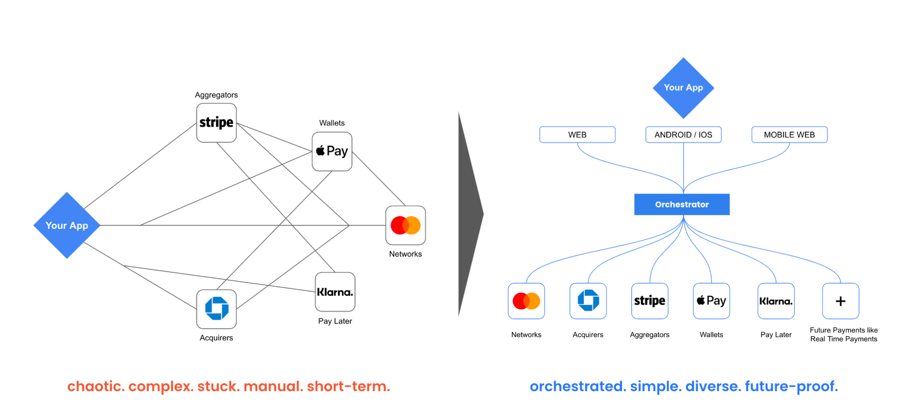

Hyperswitch is a high-performance payments switch. It allows businesses to connect to any number or variety of payment processors and offer their customers the payment method of their choice. Hyperswitch can also smartly route the payment transactions to increase revenue and reduce costs.

When you have the luxury of integrating with multiple payment processors, you can reduce the transaction processing costs easily by 20% mainly by -

    Directly using Payment Acquirers that offers a cheaper processing fee

    Optimizing the mix of Payment Methods that can drive higher usage of cheaper payment methods

    Negotiating better rates from your existing Payment Processors as you now have higher bargaining power

- Yes, the Payment Orchestrator will charge you a nominal fee that will typically be in the range of ~$100K for the assumed volume of payments.
- curd based
- reduce processing fees with smart routing
