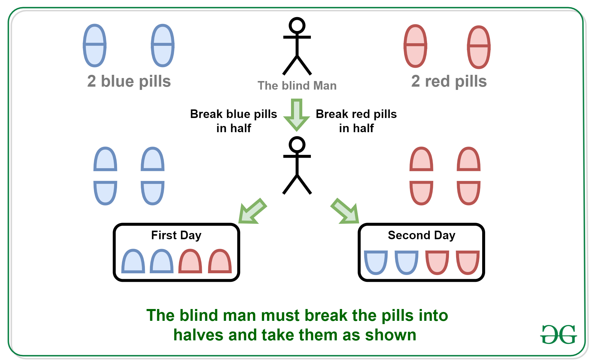

Puzzle: A blind man is alone on a deserted island. He has two blue pills and two red pills. He must take exactly one red pill and one blue pill or he will die.

How does he do it?

ans:
break all pills in half. eat each one half

